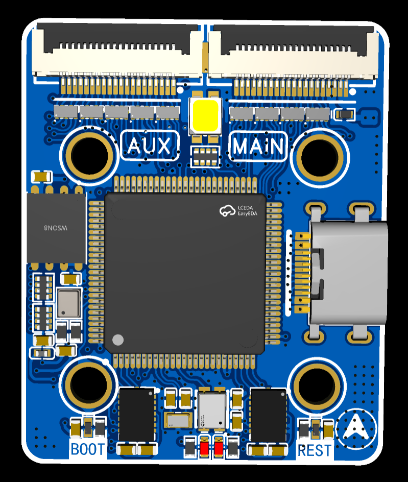
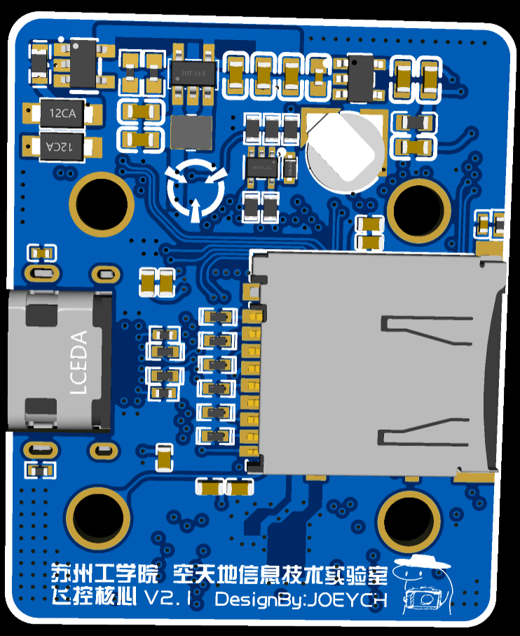
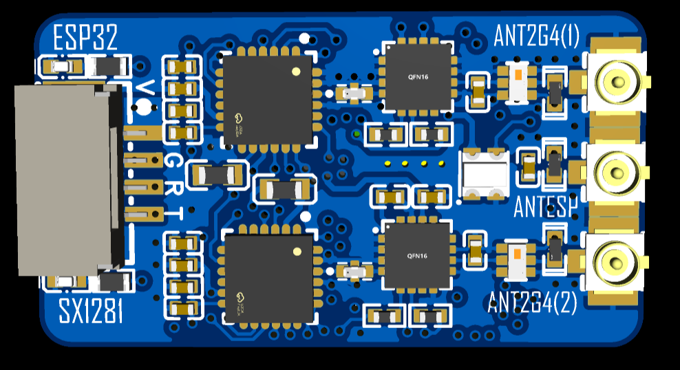
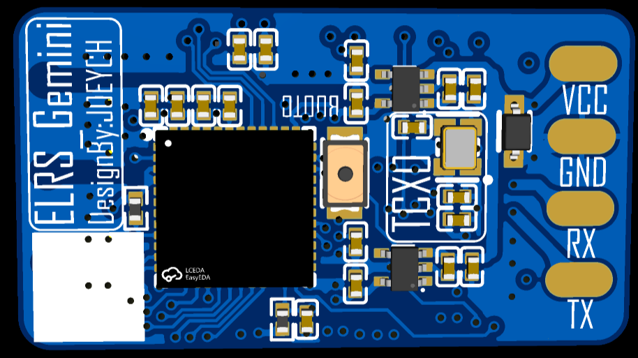
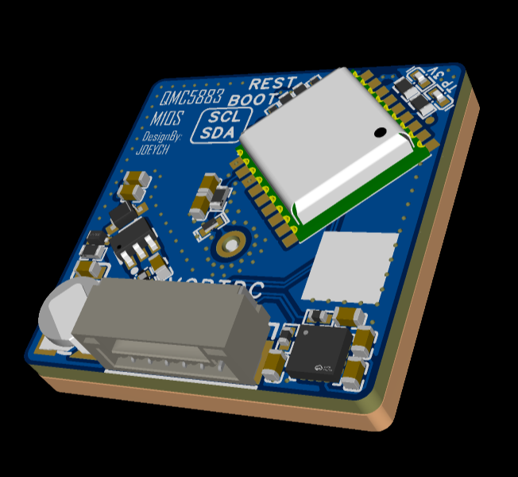

# eFlyDrone - 低成本可自制无人机平台

 基于 PX4 规范开发，参考港科大 NxtPX4 项目  

eFlyDrone 是一个面向开源硬件爱好者的低成本、可自制无人机平台项目。我们致力于提供一套完整、灵活、可扩展的硬件设计方案，允许用户根据自身需求裁剪功能，打造专属飞行器。

## 🎯 项目目标

- 低成本：所有设计均基于市面易购元器件，降低制作门槛。
- 可自制：提供完整开源设计文件（原理图、PCB、BOM），支持个人制作。
- 模块化：核心板引出所有接口，支持按需设计功能底板（如图传、避障、载荷等）。
- 兼容 PX4：遵循 PX4 飞控规范，支持 PX4 固件刷写与调试。

## 🧩 当前完成模块

✅ 飞控核心板
- 主控芯片：STM32H743VIT6
- 已完成原理图与 PCB 设计（立创EDA）
- 引出所有外设接口，支持扩展底板

| 正面 | 背面 |
|:---:|:---:|
|  |  |

✅ ELRS 双子星接收机
- 参考 SuperD 设计
- 支持 ELRS 协议，兼容主流遥控器

| 正面 | 背面 |
|:---:|:---:|
|  |  |

✅ 基于 M10S 的 GPS 接收机
- 高精度定位模块
- 支持 PX4 原生 GPS 驱动

✅ 电调参考设计
- 基于立创开源项目修改  
- 支持 PWMPPMDShot 控制协议  

## 📋 待完成模块

🚧 飞控底板  
- 根据实际应用需求设计扩展功能（如图传、数传、电源管理等）  
- 支持热插拔与模块化组合  

## 🛠️ 硬件设计工具

- 所有 PCB 设计使用 立创EDA 完成  
- 原理图、PCB、BOM 文件均开源  
- 实物尚未测试完成，欢迎参与测试与反馈！

## 📚 参考项目

- [港科大 NxtPX4](httpsgithub.comHKUST-NxtPX4) —— 项目设计灵感来源  
- [立创开源电调项目](httpsoshwhub.com) —— 电调设计参考  

## 🤝 参与贡献

欢迎提交 Issue、Pull Request 或在 Discussions 中提出建议！  
无论是硬件优化、固件适配、还是文档完善，我们都欢迎你的参与！

 ⚠️ 重要协议说明：  
 本项目采用 GPL-3.0 协议。任何基于本项目修改或衍生的作品，必须以相同协议开源，禁止闭源商用。  
 你可以在开源的前提下销售硬件或服务，但必须公开源代码并保持 GPL 协议。

## 📄 许可证

本项目采用 [GNU General Public License v3.0](LICENSE)。  
请务必阅读并遵守协议条款。任何使用、修改、分发本项目的行为，均受该协议约束。

---

 🚀 让我们一起打造属于开源社区的无人机平台！  
 项目持续更新中，敬请关注！
